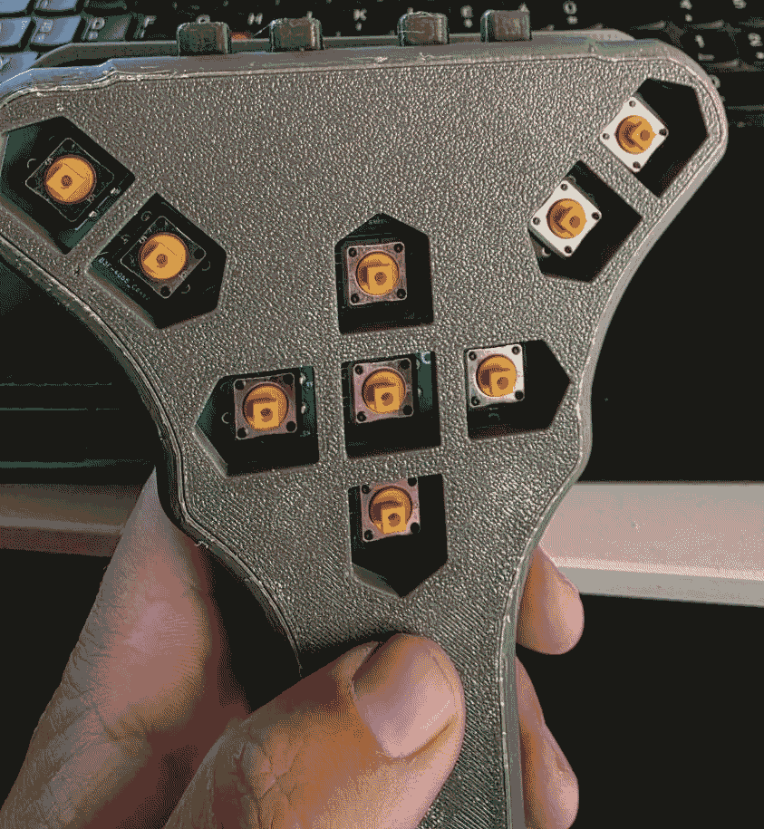
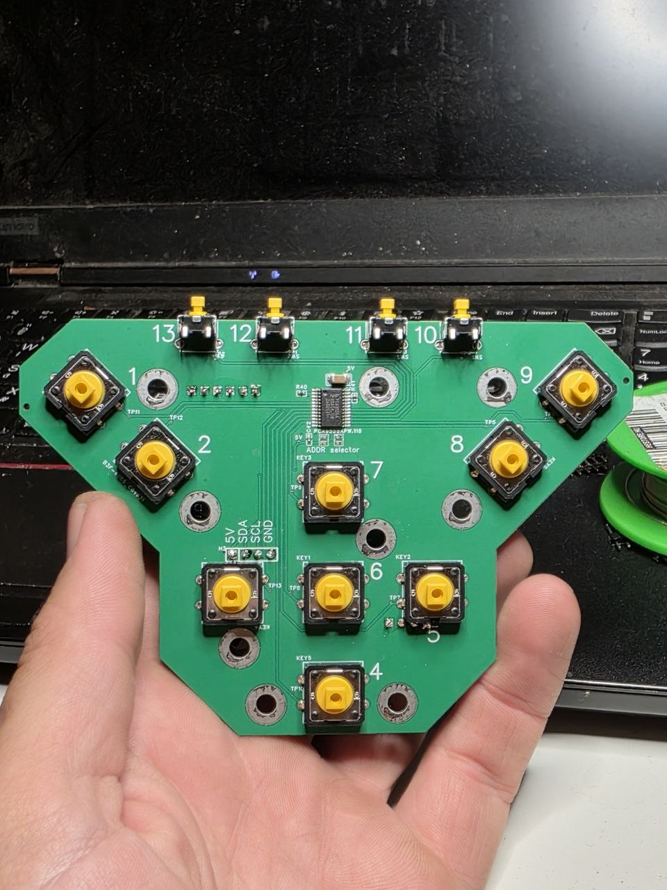
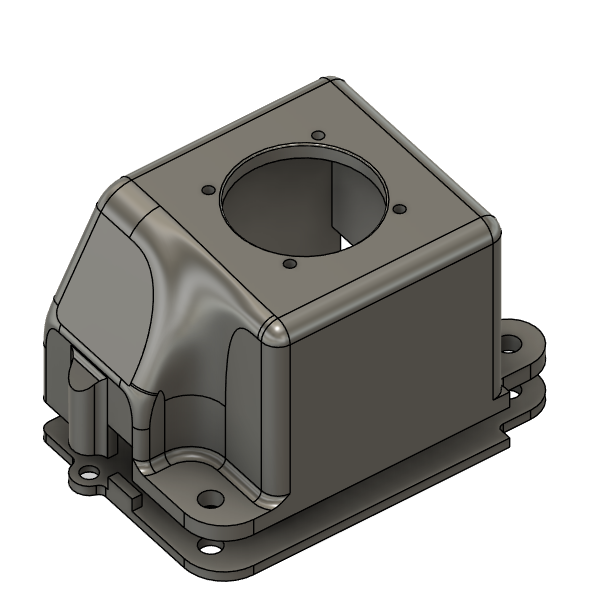

# AgIsoAuxInputs

Open-source ISOBUS **auxiliary input devices** (ISO 11783-6 AUX-N): joysticks, keypads, switch boxes. They plug into any Virtual Terminal and are assigned to implement functions through the VT's standard aux-assignment screen.

Built on [AgIsoStack++](https://github.com/Open-Agriculture/AgIsoStack-plus-plus). Not affiliated with Open-Agriculture.

<table>
  <tr>
    <td align="center"><a href="hardware/enclosures/handgrip/"></a><br>Handgrip</td>
    <td align="center"><a href="hardware/boards/handgrip/"></a><br>Handgrip keypad PCB</td>
    <td align="center"><a href="hardware/enclosures/jh-d400x/"></a><br>JH-D400X joystick housing</td>
  </tr>
  <tr>
    <td align="center" colspan="3"><a href="hardware/boards/brain/"></a><br>Brain board</td>
  </tr>
</table>

## Status

| Device | State |
|---|---|
| Joystick: 4 analog axes + 13 buttons | Working end-to-end on real hardware (ESP32-S3 + PCAN-USB + AgIsoVirtualTerminal): address claim, VT handshake, object pool upload and live aux input assignment |
| Other keypads, switch boxes, ... | Planned, same brain board |

## Hardware

One central **brain board** handles power, CAN and the ISOBUS stack. **Keypads** and joystick modules connect to it, so you build only the boards your device needs.

| Part | What it is |
|---|---|
| [Brain board](hardware/boards/brain/) | ESP32-S3, 9-16 V supply with reverse-polarity protection, CAN transceiver, 4-channel ADC and a 16-pin I/O expander on board. It works on its own on a breadboard with plain buttons, switches and pots |
| [Handgrip keypad](hardware/boards/handgrip/) | 13-button keypad for a handheld control grip, with its own PCA9555, connected over I2C. Layout inspired by the HARDI NOVA sprayer grip |
| [JH-D400X housing](hardware/enclosures/jh-d400x/) | 3D-printed housing for the JH-D400X 4-axis joystick module |
| [Handgrip housing](hardware/enclosures/handgrip/) | 3D-printed handheld grip for the Handgrip keypad |

[hardware/schematic.pdf](hardware/schematic.pdf) covers both boards: pages 1-2 are the Handgrip keypad (titled "Joystick Front"), pages 3-7 the brain board.

Both boards are also published as one open-source EasyEDA project on OSHWLab: [ESP32S3R8N8 CAN Board](https://oshwlab.com/gunicsba/esp32s3r8n8-can-board). Open it there to view or edit the design, or to order boards directly.

### Downloads

Each [GitHub release](https://github.com/gunicsba/AgIsoAuxInputs/releases) has a separate ZIP per board and per enclosure (`AgIsoAuxInputs-<version>-board-brain.zip`, `...-enclosure-jh-d400x.zip`, ...), so you can download only what you need. Board ZIPs include the Gerbers, BOM, pick-and-place and schematic.

To publish a release, push a tag:

```sh
git tag v1.0.0
git push origin v1.0.0
```

[tools/package_release.py](tools/package_release.py) builds the same ZIPs locally into `dist/`.

## Devices

### Joystick

Brain board + JH-D400X module + Handgrip keypad.

- 4 ADS1115 channels are sent as analog AUX-N inputs (function type "analogue, maintains position"), labelled `A1`-`A4`.
- 16 keypad PCA9555 pins are sent as momentary boolean AUX-N inputs. The bit number equals the silkscreen number next to each button; see the [Handgrip README](hardware/boards/handgrip/#buttons) for positions and labels.

The brain board's own PCA9555 and the optocoupler output are not used by this firmware yet.

## Build & flash

Requires [PlatformIO](https://platformio.org/).

```sh
cd firmware
pio run -e joystick -t upload
pio device monitor
```

`joystick_ota` builds the same firmware with a Wi-Fi access point for updates: SSID `joystick-auxn`, password `12345678`. Open `http://192.168.4.1/` for live input values and `/update` to upload a new firmware.

### Changing the object pool

Edit the labels or IDs in [firmware/tools/build_aux_pool.py](firmware/tools/build_aux_pool.py), then run it from `firmware/`:

```sh
python tools/build_aux_pool.py
```

The pool version string sent to the VT is a hash of the pool content, so VTs re-upload a changed pool automatically.

## Before use on a real machine

The ISOBUS NAME uses the placeholder manufacturer code `1407` (the one AgIsoStack's examples use). That is fine for bench testing against AgIsoVirtualTerminal. Get a real assigned manufacturer code before deploying on a customer's ISOBUS network.

## Roadmap

- **Device profiles**: describe each device's inputs (source chip/pin, AUX-N function type, label) in one file per device. The object pool and the input mapping are generated from it, so a new keypad only needs a new profile.
- Use the brain board's PCA9555 and skip unwired inputs.
- Configurable NAME function instance, so several devices can share one bus.
- Attach firmware binaries to releases.

## License

[WTFPL](LICENSE). AgIsoStack++ is MIT licensed.

HARDI and NOVA are trademarks of their respective owners. They are mentioned only to credit design inspiration; this project is not affiliated with or endorsed by HARDI.
