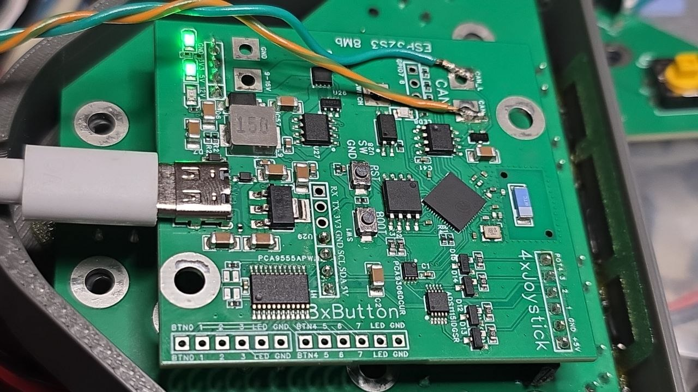

# Brain board: ESP32S3R8N8 CAN Board V1.0

The central board that every AgIsoAuxInputs device runs on. It connects to the tractor's power and ISOBUS. Keypads and joysticks connect to it.

## Features

- **Power**: 9-16 V input with reverse-polarity protection (MOSFET ideal diode, LM74700-Q1). A TPS5430 buck converter makes 5 V and an AMS1117 makes 3.3 V. The board can also be powered from USB-C.
- **CAN**: MCP2562 transceiver with PESD1CAN ESD protection (ESP32 TWAI on GPIO10/GPIO11).
- **On-board inputs**: ADS1115 4-channel ADC and a PCA9555 I/O expander (0x20). A device can be built on a breadboard with only buttons, switches and potentiometers.
- **I2C to keypads**: PCA9306 level shifter between the 3.3 V ESP32 and the 5 V keypad bus.
- **Switch output**: optocoupler (EL3H7) driven by GPIO18.
- **RST and BOOT buttons**, and power LEDs for 12 V, 5 V and 3.3 V.

## Connectors

Names in quotes are the silkscreen labels.

| Connector | Pins |
|---|---|
| WAGO terminals | 9-16V, GND, CAN_H, CAN_L, SW, SW GND |
| USB-C | Power, programming, serial log |
| "4xJoystick" (H4) | +5V, GND, POT1-POT4 |
| "8xButton" (H5, H6) | BTN0-BTN3, LED, GND and BTN4-BTN7, LED, GND |
| UART / I2C header | RX, TX, 3V3, GND, SCL, SDA, 5V (I2C at 5 V, to keypads) |
| H7 | GPIO7, GPIO8, GPIO9 (220 Ω series) |

## Files

| File | Use |
|---|---|
| `Gerber_brain.zip` | PCB fabrication |
| `BOM_brain.xlsx` | Bill of materials (LCSC part numbers) |
| `PickAndPlace_brain.xlsx` | Component placement for assembly |
| `schematic.pdf` | Pages 3-7 are this board (in the repo: `hardware/schematic.pdf`) |

To order: upload the Gerber ZIP to JLCPCB. For assembly, add the BOM and pick-and-place files.

The EasyEDA design source is on OSHWLab: [ESP32S3R8N8 CAN Board](https://oshwlab.com/gunicsba/esp32s3r8n8-can-board).

## Changes

2026-09-13 - Added FASTLED compatible Output

2026-09-13 - Parts shortage: replaced the NCV68061 ideal diode controller (U26) with a TI LM74700-Q1 (U7, LCSC C2941042) and added its 100nF capacitor (C3)
